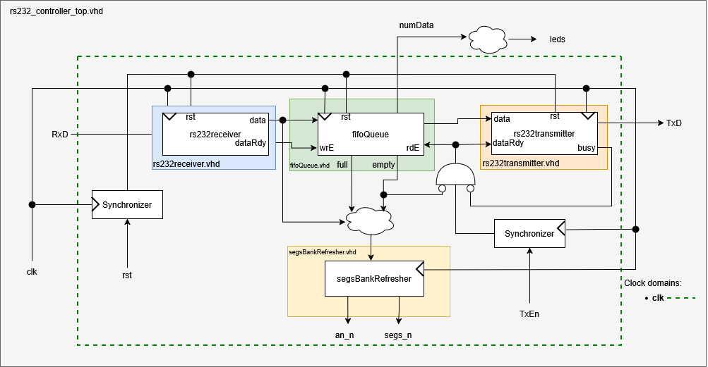

# FPGA RS-232 UART Transceiver with BRAM FIFO

## 📌 Overview
Robust VHDL implementation of an RS-232 UART controller with an integrated Block RAM (BRAM) FIFO buffer. Designed and implemented on the **Basys 3 (Artix-7 xc7a35tcpg236-1)** FPGA board. The system allows for asynchronous serial communication, buffering incoming data to prevent loss during processing bottlenecks.

## ⚙️ Features
* **Custom UART Datapath & Control:** Clear separation of Datapath and Finite State Machines (FSM) for both transmission and reception.
* **Dual-Clock Domain Synchronization:** Implementation of 2-stage synchronizers for external asynchronous signals (RxD, TxEn, and external reset) to prevent metastability.
* **BRAM-based Circular FIFO:** Uses Xilinx IP Block RAM (16x8) for efficient data storage without depleting standard slice logic.
* **Real-time Diagnostics:** Multiplexed 7-segment display logic to monitor FIFO state (Full/Empty) and the latest received byte.

## 🏗️ System Architecture

## 🚀 Implementation Results
The design has been synthesized and implemented in Vivado 2023.1, successfully passing all timing constraints.
* **Target Clock:** 100 MHz 
* **Max Achieved Frequency:** 134 MHz 
* **Worst Negative Slack (WNS):** 2.565 ns 
* **Resource Utilization:**
    * Slice LUTs: 124 (0.60%) 
    * Slice Registers: 111 (0.27%) 
    * Block RAM: 0.5 (1.00%)
* **Dynamic Power Consumption:** 0.004 W 

## 🛠️ How to Build
To reconstruct this project in Xilinx Vivado:
1. Create a new RTL project targeting the `xc7a35tcpg236-1` device.
2. Add all VHDL design sources from the `/src` directory.
3. Import the BRAM IP core by adding the `/ip/BRAM_FIFO/BRAM_FIFO.xci` file.
4. Add the physical constraints file from `/xdc/`.
5. Run Synthesis, Implementation, and Generate Bitstream.

---
*Designed by [Daniel Barroso Corral] as part of Advanced Digital System Design studies.*